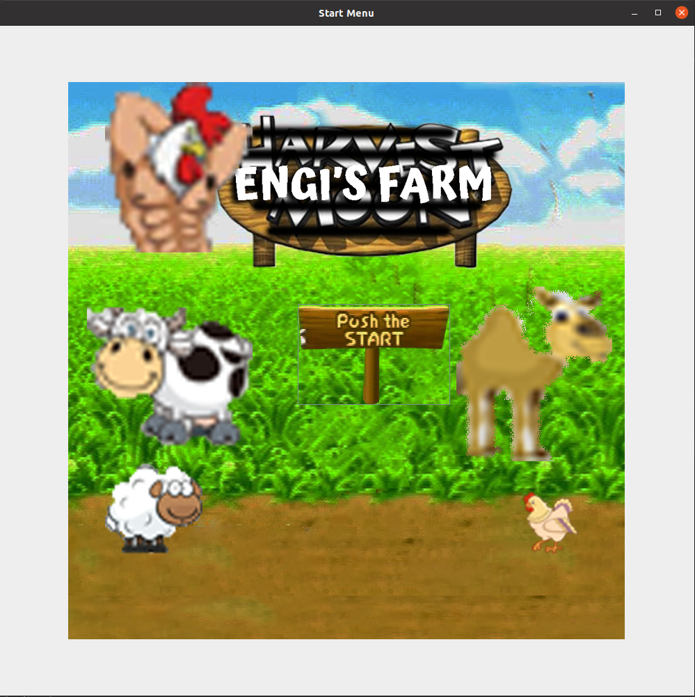
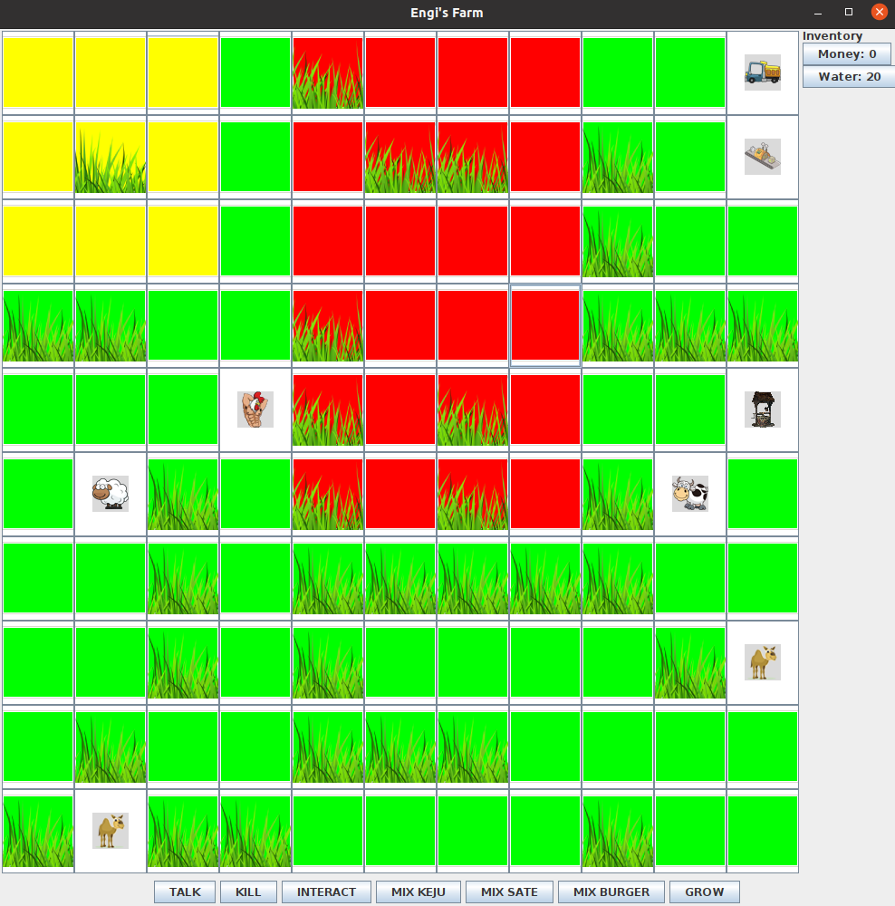
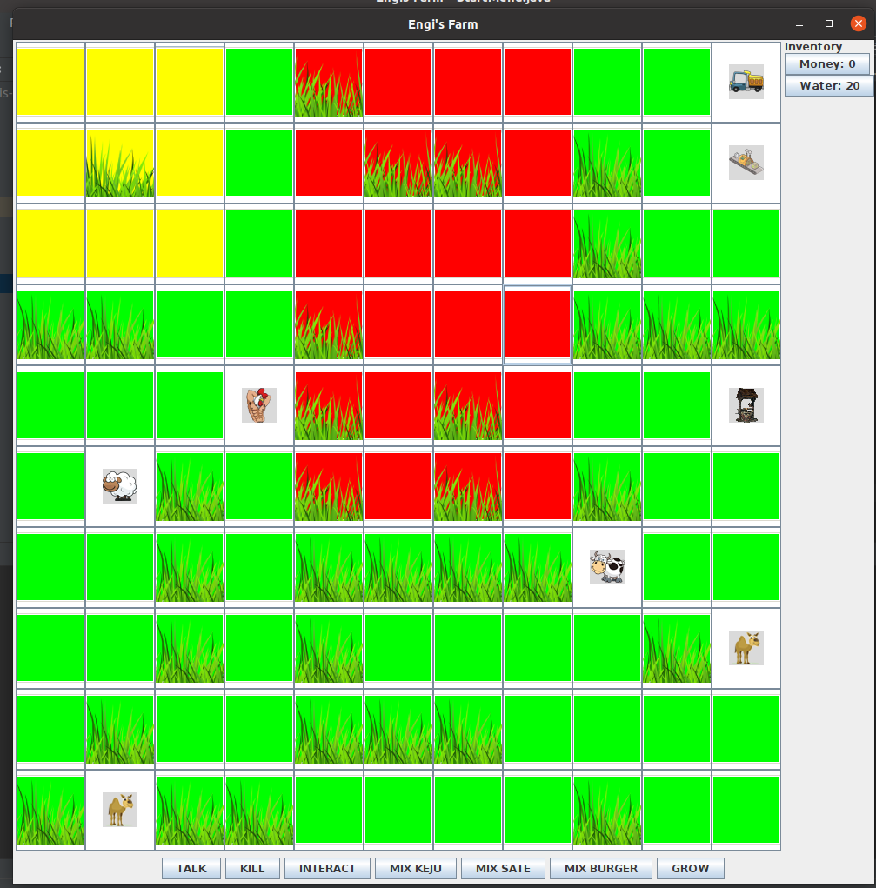

# Engi's Farm


## What is it?
Engi's Farm is a Harvest Moon like game that simulate daily life of a farmer in its farm. The primary objective is to restore and maintain a farm that has fallen into disrepair by deciding between what most important task right now the farmer can do. The task ranging from clearing land, raising livestock, to slaugthering the livestock to get its product.

## Requirements
* Java
* Swing GUI

## How to Run
```
$ java -jar Engi\'s\ Farm.jar
```

## Screenshoot




## Author
* [Abda Saffan Diva](https://github.com/abdashaffan)
* [Ferdian Ifkarsyah](https://github.com/Ifkarsyah)
* [Juniardi Akbar](https://github.com/juniardiakbar)
* [Nur Alam Hasabie](https://github.com/AlamHasabie)